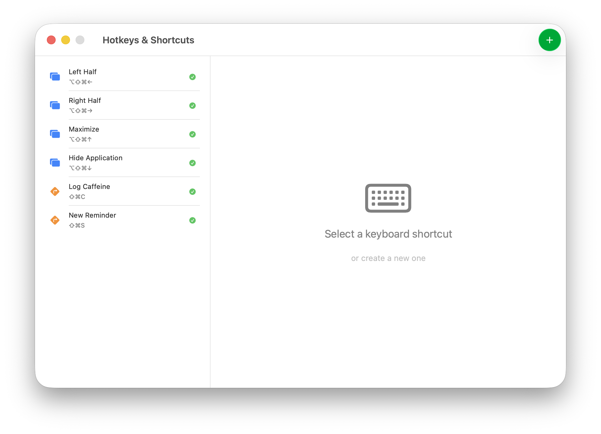
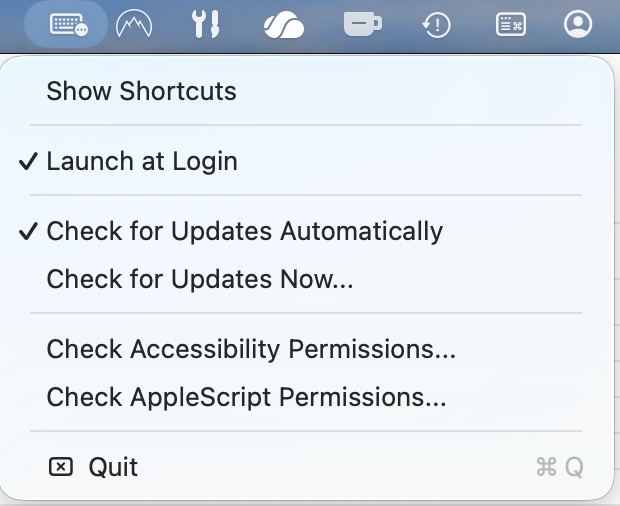
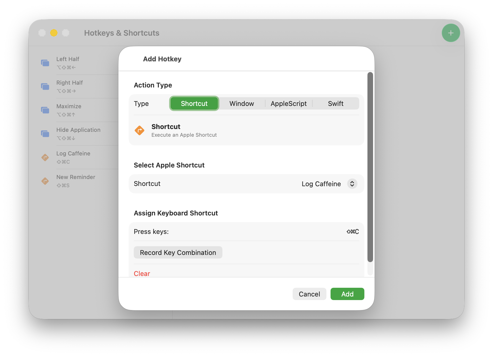
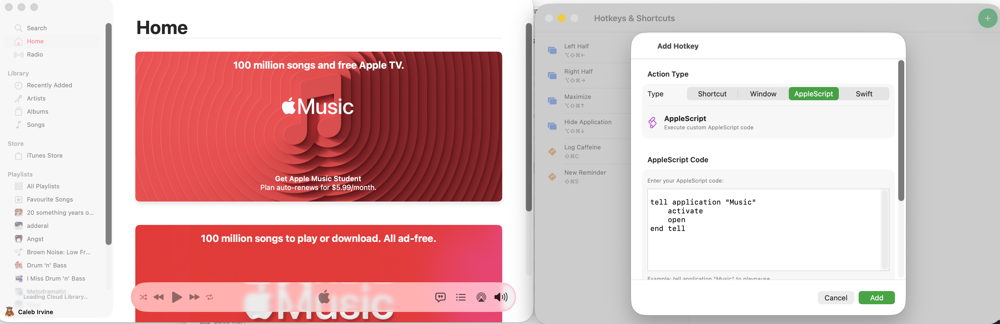

# Hotkeys & Shortcuts

Create custom keyboard shortcuts to automate your Mac. Run Apple Shortcuts, execute AppleScript, and manage windows with simple hotkeys.

## What It Does

Trigger powerful actions with keyboard shortcuts:
- **Run Shortcuts** - Launch any Apple Shortcut instantly
- **AppleScript** - Automate apps and UI interactions
- **Quick Math** - Evaluate expressions on the fly
- **Window Snapping** - Move and resize windows across displays

## Features

- **Custom Hotkeys** - Works system-wide, even overriding built-in shortcuts
- **Shortcuts Integration** - Run any Apple Shortcut with a keypress
- **AppleScript** - Write custom automation scripts
- **Window Management** - Snap and move windows between displays
- **Auto-Updates** - Automatically checks for new versions
- **Launch at Login** - Optional startup integration

## Getting Started

1. Download from [Releases](https://github.com/calebmirvine/HotkeysAndShortcuts/releases)
2. Move to Applications and launch
3. Grant permissions when prompted (Accessibility & Automation)
4. Create your first hotkey in the app
5. Press your hotkey anywhere - it works system-wide!

## Requirements

- macOS 13.0 or newer (Ventura+)
- Accessibility permissions (for keyboard interception)
- Automation permissions (for AppleScript)

## Built With

Swift, SwiftUI, and native macOS frameworks. Auto-updates via Sparkle.

For developers: See [RELEASE_INSTRUCTIONS.md](RELEASE_INSTRUCTIONS.md) for build info.

